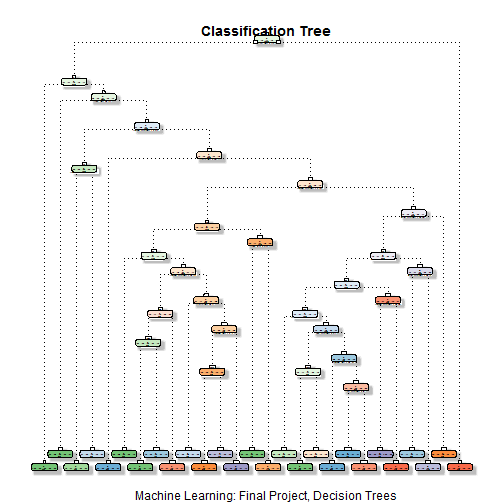

## Introduction  
Using devices such as Jawbone Up, Nike FuelBand, and Fitbit it is now possible to collect a large amount of data about personal activity relatively inexpensively. A group of enthusiasts measured their activities regularly using those electronic devices. They were asked to perform barbell lifts correctly and incorrectly in 5 different ways. These athletes recorded plenty of data about a particular activity they do, but they rarely quantify how well they do it.  

We sourced the data collected from accelerometers worn on the belt, forearm, arm, and dumbbell by 6 participants and it is the subject of predictive analysis performed below. 

## Data Preprocessing  

### Origin of the Data. The raw dataset for this exercise is downloaded from Human Activity Recognition (HAR) project, a [Groupware project (click to be redirected to the URL)](http://groupware.les.inf.puc-rio.br/har).  

### Downloading the source files and reading into data frames...  


```r
train_Base <- read.csv("https://d396qusza40orc.cloudfront.net/predmachlearn/pml-training.csv", na.strings=c("NA","#DIV/0!",""))
test_Base <- read.csv("https://d396qusza40orc.cloudfront.net/predmachlearn/pml-testing.csv", na.strings=c("NA","#DIV/0!",""))
```
The initial training data set contains 19622 observations and 53 variables, while the testing data set contains 20 observations and 52 variables. The "classe" variable in the training set is the outcome to predict. 

### Data Cleaning
In the next section missing values `NA`'s are removed from our data sets; initially, the columns containing missing values will be removed and then the columns that are irrelevant for our predictors (*like timestamps and windows*) will be dropped. Also, column *problem_id* is removed from the training file.  


####Normalizing the data  
by bringing the data sets to a common (*numeric*) data type and thus removing more  variables unrelated to the accelerometer measurements are; only the columns containing numeric data will remain(*also, making sure that `classe` column is preserved*).  

Now, the coerced data sets, each containing 52 variables, will be used to build predictors based on cleaned `training` and `testing` data sets, having 19622 and  19622 observations respectively. 

In the following section the initial Training data set will be split into sub-data sets (sub-Training and sub-Testing) for cross-validation of our base data. The split will be __70/30__ respectively from the final `train_Base` data set on aforementioned `classe` column.  


```r
set.seed(15243) # To ensure the results are consistent over multiple trials
inTrain <- createDataPartition(train_Base$classe, p=0.7, list=FALSE)
training <- train_Base[inTrain, ]
testing <- train_Base[-inTrain, ]
```

### Modeling predictors  
*__Decision Tree__* algorithm is used next to predict using `testing` data set.    

```r
modFitDT <- rpart(classe ~ ., data=training, method="class")
```

```
## Warning in model.matrix.default(attr(frame, "terms"), frame): the response
## appeared on the right-hand side and was dropped
```

```
## Warning in model.matrix.default(attr(frame, "terms"), frame): problem with
## term 53 in model.matrix: no columns are assigned
```

```
## Warning in cats * (!isord): longer object length is not a multiple of
## shorter object length
```

```r
predDT <- predict(modFitDT, testing, type = "class")
cnfMtrDT <- confusionMatrix(predDT, testing$classe)
cnfMtrDT
```

```
## Confusion Matrix and Statistics
## 
##           Reference
## Prediction    A    B    C    D    E
##          A 1484  144   18   65   59
##          B   43  747   79   51   67
##          C   17  142  825  184  125
##          D  109   95   52  629   65
##          E   21   11   52   35  766
## 
## Overall Statistics
##                                           
##                Accuracy : 0.7563          
##                  95% CI : (0.7452, 0.7673)
##     No Information Rate : 0.2845          
##     P-Value [Acc > NIR] : < 2.2e-16       
##                                           
##                   Kappa : 0.6914          
##  Mcnemar's Test P-Value : < 2.2e-16       
## 
## Statistics by Class:
## 
##                      Class: A Class: B Class: C Class: D Class: E
## Sensitivity            0.8865   0.6558   0.8041   0.6525   0.7079
## Specificity            0.9321   0.9494   0.9037   0.9348   0.9752
## Pos Pred Value         0.8384   0.7568   0.6381   0.6621   0.8655
## Neg Pred Value         0.9538   0.9200   0.9562   0.9321   0.9368
## Prevalence             0.2845   0.1935   0.1743   0.1638   0.1839
## Detection Rate         0.2522   0.1269   0.1402   0.1069   0.1302
## Detection Prevalence   0.3008   0.1677   0.2197   0.1614   0.1504
## Balanced Accuracy      0.9093   0.8026   0.8539   0.7936   0.8416
```

#### Figure 1. Decision Tree Visualization    
This is how predicted Classification Tree looks like:  
 

This __Classification Tree__ algorithm has the accuracy of 75.63%. Not too exciting...   

#### Further, a *5-fold cross validation* in the __Random Forest__ model fit wil be implemented - 
by the number of factors in `classe` variable. The assumption that this predictor will outperform the previous __Decision Tree__ predictor.  


```r
# Building the Random Forest predictor using testing data set
ctrlRF <- trainControl(method="cv", length(levels(testing$classe)))
modFitRF <- train(classe ~ ., data = training, method="rf", trControl = ctrlRF, ntree=250)
```

```
## Warning in model.matrix.default(Terms, m, contrasts, na.action =
## na.action): the response appeared on the right-hand side and was dropped
```

```
## Warning in model.matrix.default(Terms, m, contrasts, na.action =
## na.action): problem with term 53 in model.matrix: no columns are assigned
```
  
#### Finally, we evaluate the *Random Forest* predictor on the validation (`testing`) data set.  


```r
predRF <- predict(modFitRF, testing)
cnfMtrRF <- confusionMatrix(testing$classe, predRF)
cnfMtrRF
```

```
## Confusion Matrix and Statistics
## 
##           Reference
## Prediction    A    B    C    D    E
##          A 1672    2    0    0    0
##          B    8 1129    1    0    1
##          C    0    7 1013    6    0
##          D    0    0   11  952    1
##          E    0    1    0    1 1080
## 
## Overall Statistics
##                                          
##                Accuracy : 0.9934         
##                  95% CI : (0.991, 0.9953)
##     No Information Rate : 0.2855         
##     P-Value [Acc > NIR] : < 2.2e-16      
##                                          
##                   Kappa : 0.9916         
##  Mcnemar's Test P-Value : NA             
## 
## Statistics by Class:
## 
##                      Class: A Class: B Class: C Class: D Class: E
## Sensitivity            0.9952   0.9912   0.9883   0.9927   0.9982
## Specificity            0.9995   0.9979   0.9973   0.9976   0.9996
## Pos Pred Value         0.9988   0.9912   0.9873   0.9876   0.9982
## Neg Pred Value         0.9981   0.9979   0.9975   0.9986   0.9996
## Prevalence             0.2855   0.1935   0.1742   0.1630   0.1839
## Detection Rate         0.2841   0.1918   0.1721   0.1618   0.1835
## Detection Prevalence   0.2845   0.1935   0.1743   0.1638   0.1839
## Balanced Accuracy      0.9974   0.9946   0.9928   0.9951   0.9989
```

The Est. accuracy of the Random Forest prediction model is 99.34% with the Est. Out of sample Error 0.66%. The __Random Forest__ predictor, as expected, outperforms other predictors (in this exercise the *Classification Decision tree*) and yields a much better in-sample prediction.

### Predicting for the original Test Data Set (`test_Base`)
Now, we apply the model to the original testing data set downloaded from the data source and cleaned to run this test.  


```r
Testresult <- predict(modFitRF, test_Base)
#Predicted values for Test submission.
Testresult
```

```
##  [1] B A B A A E D B A A B C B A E E A B B B
## Levels: A B C D E
```
